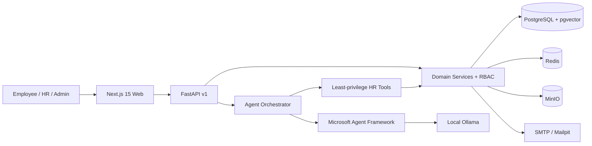

# Aurora HR

**The Autonomous AI Workforce Operating System** — an enterprise HRMS demo that combines a premium workforce dashboard with ten private, tool-using AI agents.

Aurora covers employee management, attendance, leave, payroll, notifications, documents, organization analytics, auditability, OAuth-ready authentication, and a dedicated AI workforce control plane. It is designed around free/open-source infrastructure and runs locally with Docker.

## Product highlights

- Executive dashboard with workforce health, attendance, approvals, payroll, and burnout signals
- Employee directory, organization structure, leave decisions, attendance monitoring, and payroll summaries
- Ten specialized agents: HR Copilot, Attendance, Leave, Payroll, Onboarding, Insights, Analytics, Notification, Policy, and Resume Intelligence
- Microsoft Agent Framework integration using local Ollama function tools; deterministic fallback keeps the demo usable without a downloaded model
- PostgreSQL 16 + pgvector, Redis, MinIO object storage, Mailpit SMTP, FastAPI, and Next.js 15
- JWT access/refresh token primitives, RBAC-ready models, OAuth configuration for Google/Microsoft, validation, CORS, security headers, and immutable audit model
- 50 deterministic demo employees across six departments

## Start locally

Prerequisites: Docker Desktop with Compose v2. No paid API key is required.

```bash
cp .env.example .env
docker compose up --build
```

Open:

- Product: http://localhost:3000
- FastAPI / Swagger: http://localhost:8000/docs
- Mailpit inbox: http://localhost:8025
- MinIO console: http://localhost:9001

To enable generative agent planning, download a local model once:

```bash
docker compose exec ollama ollama pull qwen2.5:3b
```

The application remains functional without the model: agent routing, tools, explainability, and demo insights fall back to deterministic logic.

Authentication setup, Google/Microsoft callback configuration, generated login IDs, and demo credentials are documented in [docs/AUTHENTICATION.md](docs/AUTHENTICATION.md).

## Develop without Docker

```bash
# terminal 1
cd backend
python -m venv .venv
.venv/Scripts/pip install -r requirements.txt
.venv/Scripts/uvicorn app.main:app --reload

# terminal 2
cd frontend
npm install
npm run dev
```

## Architecture



The agents never mutate tables directly. They call typed domain tools, which enforce authorization, validation, transactions, and audit recording. See [Architecture](docs/ARCHITECTURE.md), [AI system](docs/AI.md), and [Deployment](docs/DEPLOYMENT.md).

## Repository layout

```text
frontend/           Next.js App Router UI, charts, motion, AI command surface
backend/app/        FastAPI, schemas, security, domain models, agents, demo data
backend/tests/      API and agent contract tests
docs/               Architecture, AI, deployment, and demo guides
.github/workflows/  Frontend and backend CI
docker-compose.yml  Complete free local stack
```

## Quality checks

```bash
cd frontend && npm run lint && npm run build
cd backend && ruff check . && pytest
```

## Production configuration

Set a strong `JWT_SECRET`, HTTPS-only cookies, real Google/Microsoft OAuth credentials and callback URLs, managed PostgreSQL with pgvector, and SMTP credentials. Use Neon/Supabase PostgreSQL on their free tier, Vercel for the web app, and Render for the Docker API. Never commit `.env`.

## License

[MIT](LICENSE)
