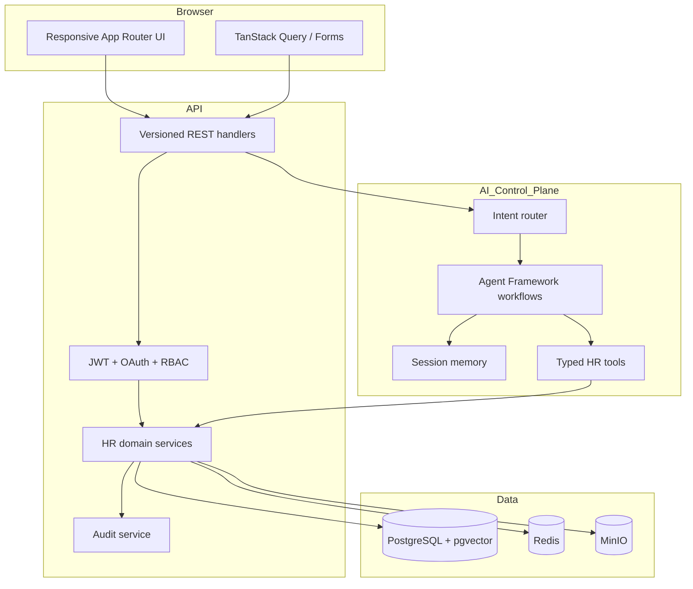
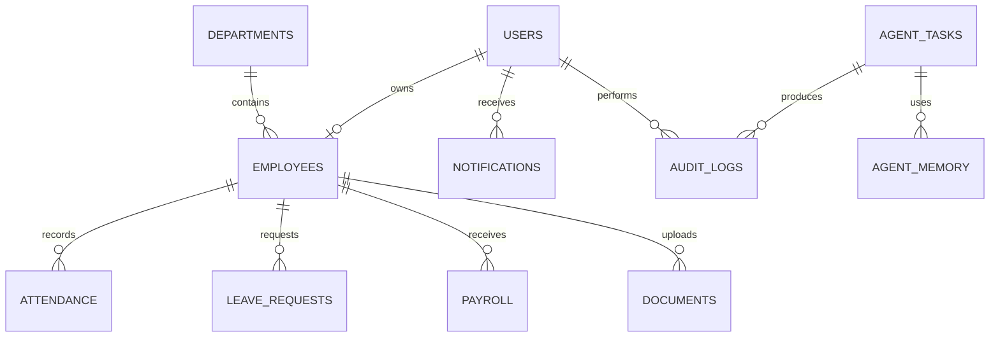

# Architecture

Aurora is a modular monorepo with a Next.js presentation layer and a FastAPI application layer. The backend follows feature-oriented clean architecture: HTTP handlers validate contracts; services own use cases; repositories own persistence; agents can invoke services only through registered tools.

## Runtime boundaries

## Data model

Core models are in `backend/app/models.py`. PostgreSQL JSONB stores explainable agent plans and salary component breakdowns; pgvector is reserved for policy/document embeddings.

## Security decisions

- Short-lived access tokens and rotated refresh tokens; refresh token hashes are stored, never raw tokens.
- RBAC is checked at use-case boundaries, not only route middleware.
- Agent tools are least-privilege and auditable. Destructive operations require an explicit user confirmation stage.
- Uploads use allowlisted MIME types, generated object keys, size limits, and malware scanning in production.
- CORS is allowlisted; responses include anti-sniffing, frame, referrer, and browser-permission headers.
- Salary, government ID, and token fields must be encrypted at rest in production.

